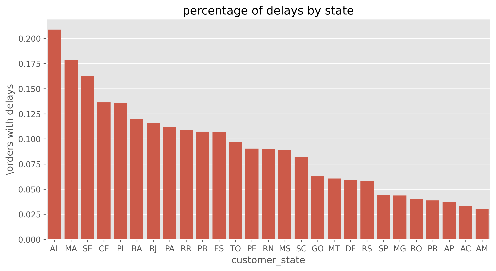

<h1 align="center">📊  Olist E-Commerce Analysis </h1>

 

  I am sharing my Exploratory Data Analysis (EDA) and data visualization using Python. The goal is to audit
business performance by quantifying patterns in sales seasonality, logistics efficiency, and customer behavior.

 

  

<h2>📑 Index </h2>

1. [🪪 About the Project](#about)
2. [🛠️ Technical Stack and Methodology](#tech)
3. [⛓️‍💥 Main question](#question)
4. [🔍 Key Findings](#findings)
5. [🚩 Locations](#locations)
6. [🚐 Deliveries](#deliveries)
7. [🪠🧻🫧 Most recurring products](#products)
8. [📈 Sales Forecast](#forecast)
9. [📈 Life Cycle and Sales](#lifecycle)
10. [⚙️ Technologies used](#technologies)
11. [⌨️ Data](#data)

 
<h2 id="about">🪪 About the Project </h2>

  Olist is a leading Brazilian e-commerce platform that connects small businesses with the country's main marketplaces. Operating as a
  SaaS technology company, it facilitates the sale of products from thousands of sellers to millions of customers.
This project consisted of an Olist performance audit (2016-2018) using real public data. Although the company shows a **strong positive trend in sales**, it
faces a critical **retention** challenge, the percentage of one-time purchases is 96.99% of customers who only buy once.

 
<h2 id="tech">🛠️ Technical Stack and Methodology</h2>

- **Data cleaning:**  Management of null values, conversion of data types (timestamps), and merging of eight relational data sets.
- **Geospatial analysis:**  Mapping of customer distribution and calculation of delay rates by state (comparison between SLA and actual delivery).
- **Customer segmentation:** Identification of repeat users and purchasing patterns using advanced aggregation operations (`groupby`, `nunique`).
- **Logistics optimization:** Detection of critical states (AL, MA, SE) with delay rates above 15%, suggesting the need for regional distribution centers.

 
<h2 id="question">⛓️‍💥 Main question:</h2>
How can we optimize the customer experience to maximize retention and lifetime value?

 
 
<h2 id="findings">🔍 Key Findings </h2>
 Types of customers and their rankings.

- **What do they buy?** Their main categories are **Furniture and Decor** and **Bed, Bath, and Tableware**.
- **Reviews:** In negative reviews (1-2 stars), we found that complaints about the product (quality, defects, differences from the description) are twice as frequent as complaints about Logistics.
  - **Product Complaints:** ~8,800 mentions.
  - **Logistics complaints:** ~4,300 mentions.

The problem is not loyal customers, it is that the furniture products have quality/shipping issues.

 
<h2 id="locations">🚩 Locations </h2>

***Who are our best customers and where are they located?***

- Customers usually only buy once, representing 89.5% of sales. Most customers are in Sao Paulo and Rio de Janeiro.
- Spending per customer: approximately $20 to $60.

Customer states

  

Amount spending  per customer

  

 
<h2 id="deliveries"> 🚐 Deliveries </h2>

***Do deliveries meet the estimated dates?***

***In which regions is logistics failing?***

- On average, Olist delivers packages ahead of the estimated date.

- Northeastern states (**AL, MA, and SE**) experience the highest delay rates (>15%).

  

 

<h2 id="products"> 🪠🧻🫧 Most recurring products </h2>

**The products most purchased by repetitive customers are:**
 
 - cama_mesa_banho -------           3362
- moveis_decoracao  --------        3344
- informatica_acessorios ---    1997
- utilidades_domesticas ----     1851
- esporte_lazer --------------              1762

 

**The products most purchased by new customers are:**
- belleza_saude -------------                     7925
- cama_mesa_banho--------           7745
- esporte_lazer--------------                      6727
- informatica_acessorios----    5711
- relogios_presentes--------           5185

 
<h2 id="forecast"> 📈 Sales Forecast </h2>
A linear regression analysis confirms a steady **monthly upward trend** in revenue. The business is scaling, with significant seasonal peaks during **Black Friday (November)**.

  

 
Sales show marked seasonality with peaks on Black Friday (November) and natural post-Christmas declines, but the overall trend line is positive and robust.
 

  

<h2 id="lifecycle"> 📈 Life Cycle and Sales </h2>
Well, the result is interesting. Half of repeat customers make another purchase within a month. But we also see that there are customers who place several orders on the same day.

Data: 78.78 days. The “mean” is far from the median (29). The average is “skewed” by those customers who took 600 days (the maximum).

  

 

<h2 id="technologies">⚙️ Technologies used: </h2>
 `Python`, `Pandas`, `Seaborn`, `Matplotlib`
 

 <h2 id="data">⌨️ Data: </h2>
 [Olist Brazilian E-Commerce Public Dataset](https://www.kaggle.com/olistbr/brazilian-ecommerce)
 
 

**Developed by:** Barbara V. Cedeño A.